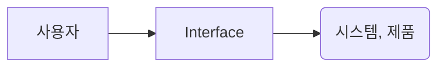

# UI란 무엇인가?

태그: 강의, 이론

## UI(User Interface)란?

> `Interface` - 면과 면을 서로 왔다갔다 하는 것
> 

위에서 이야기하는 `면`이라는 것은 보통 스크린을 이야기함.

- `HCI(Human Computer Interaction)`
- `Normal Using System` - 사용자 하나와 시스템 하나 사이의 인터페이스
- `인트라넷` - 사용자 여럿과 하나의 시스템, 회사 전체의 정보를 서로 공유 가능한 네트워크를 말함

사용자 인터페이스 디자인 - `HCI`로 한정한다는 의미.

수업, 온라인 수업 등은 주로 `CMC` 시스템을 사용함.

휴먼과 휴먼 인터페이스(face-to-face)

## Interaction 모델

사용자는 필요와 목적에 따라 인지적 시스템, 제품을 사용하게 됩니다.

인터페이스는 사용자와 해당 시스템, 또는 제품 가운데에 위치합니다.

### 1) 심성 모델이란?

> 사용자의 심성 모형, 즉 멘탈 모델은 사람들이 특정 맥락에 가지고 있는 인지 모형을 의미합니다.
> 
- 어른들은 주로 마우스를 사용하는 것이 편하지만, 어린 학생들은 가끔 TV의 상태를 바꾸기 위해 터치를 시도하기도 합니다. - 이는 사람마다 경험이 다르기 때문, 어른들은 touch interaction 모델이 발달되지 않았지만, 어린 아이들은 해당 모델이 가장 먼저 발달되기 때문일 것

사용자는 위와 같이 **인터페이스**를 통해 **시스템이나 제품의 다양한 정보나 서비스를 취득**합니다.

따라서 사용자 집단의 멘탈 모델을 고려한 디자인이 필요합니다.

`HCI`는 사람과 상호작용이 가능한 시스템이 사람과 잘 어울려 주어진 목표를 달성할 수 있도록 둘 사이의 `Interaction`(상호작용 방법과 절차)를 설계하고 평가하며 구현하는 분야가 바로 `HCI`입니다.

- `PUI(Physical User Interface)` : 폼펙터를 비롯한 물리적 형태와, 사이즈 어포던스
    - 물리적 키배열, 키매핑, 다양한 디바이스와 리모콘, 버튼과 조그 셔틀 등 물리적 인터페이스
- `GUI(Graphic User Interface)` : 스크린에 디자인 되는 것
    - 텍스트, 색상, 아이콘, 메류, 메타포 등 그래픽적 요소
- `SUI(Sound User Interface)` : 피지컬 유저 인터페이스와 그래픽 유저 인터페이스 사이에서 역할을 함
    - 햅틱, 사운드 디자인 등

위 `Interface`들은 사용자 단에서 인터렉션을 할 수 있는 것들입니다.

인터페이스에는 터치, 목소리, 지문, 정맥, 표정, 키보드 입력 등이 있을 수 있다.

시스템은 정보와 서비스, 컨텐츠 등을 눈이나 귀, 피부를 통해 느낌

다양한 인터페이스 방식이 존재할 것입니다.

`OS(Operating System)` : 컴퓨터화된 디바이스의 하드웨어나 소프트웨어 리소스를 관리하고 컴퓨터 프로그램에 대한 공통적인 서비스를 제공하는 시스템 소프트웨어

특징에 맞는 인터페이스 디자인을 요구하기도 함 → 따라서 디자이너는 OS를 이해하고 있을 필요가 있다.

---

## 인터렉션과 사용성, 접근성

### 1) 인터렉션

- 다양한 인터렉션이 존재함
- 터치 인터렉션, 음성, 제스쳐를 이용하는 인터렉션

### 2) 사용성

- 사용자의 목표 달성을 위한 제품, 서비스, 시스템 등 사용 → 이를 얼마나 효율적으로 만족스럽게 사용했는지를 의미합니다.
- 사용성 테스트 : 프로토타이핑을 했다는 것 = 프로토타이핑을 통해 평가, 측정하는 것을 의미한다.
    - 프로토타이핑 결과물을 가지고 유저 테스트(UT)를 진행한다.
    - **프로토타이핑과** **사용성 테스트**는 보통 함께 진행한다 - 밀접한 연관이 있음

### 3) 접근성

- 접근성은

### 4) 유니버셜 디자인

- Interactive한 기기가 늘어나면서

### 5) 표준 제정

- 여러 기관이 표준을 제정하고, 많은 사람이 공평하게 정보에 접근할 수 있도록 한다.

### 6) IA (Information Architecture)

- 정보 구조와 워크플로우
- 정보 구조의 종류, 분류, 메뉴구조, 워크플로우의 작성법

---

## UI 디자인의 이해

### 1) UI 디자인의 사례

- 팀 버너스리의 웹 페이지 - 월드 와이드 웹을 처음으로 주장함
- 1991년 8월 6일 최초의 웹사이트를 제작하였다.
- `CERN`의 `NeXT`라는 컴퓨터에서 실행 - 최초의 웹은 1991년도에 생성되었지만 보존되지 못했음

위와 같이 다양한 용어를 설명해놓고 관련 문서들을 서로 링크해놓은 형태로 되어 있음

### 2) 구글 검색 엔진의 인터페이스 디자인

> 구글은 1996년 1월, 캘리포니아의 스탠포드 대학에서 박사 과정 학생이었을 때 연구 프로젝트로 시작하게 되었음
> 
- 검색 알고리즘 - 최초에는 웹 페이지의 가치는 그 페이지를 링크한 백링크의 수와 관련있다는 이론을 바탕으로 검색 엔진을 제작하기 시작함
- 이를 바탕으로 페이지 랭크라는 알고리즘을 만들었음
- 검색 결과의 품질이 현재 구글을 1위로 만들게 되었음

당시 구글이 나올 때 야후가 검색 엔진 1위를 차지하였음 :

구글은 심플한 인터페이스로 화면을 구성한 반면, 야후 코리아는 디렉토리 방식을 이용해 검색을 하도록 되어 있었습니다.

- 구글의 심플한 인터페이스 디자인 → 검색의 강점을 부각시키게 됨
- 구글의 I’m Feeling Lucky 버튼은 사실상 손해 → 구글의 주요 수입인 광고를 통한 수입을 얻지 못하기 때문
    - 하지만, 이는 구글의 초기 인터페이스부터 계속 존재해왔기 때문에, 최초 디자인의 대범함을 보여주는 것이라고 할 수 있다.
    - 검색 엔진을 강조하는 인터페이스 디자인을 계속 유지해오는 **일관성**을 지켰다고 할 수 있다.
    - 좋은 UI 디자인은 최소한으로 디자인해야 한다.

### 3) 삼성페이의 인터페이스

> 삼성페이는 삼성전자가 제공하는 모바일 결제 및 디지털 지갑 서비스
> 
- `NFC` - 근거리 무선 통신을 사용한 비접촉 결제 지원을 의미함
- `MST(Magnetic Secure Transmission)` - 근거리 자기장 파형을 직접 생성하여 카드 결제기에 마그네틱 스트립의 긁는 동작을 모방하는 **자기 보안 전송 기술**
- 하지만 기존의 마그네틱 보안 전송을 통한 전용 결제 단말기도 지원을 해야 했음 - 그래서 해당 사항을 고려해 성공적으로 인터페이스 디자인을 구현하게 됨
- 해당 기술을 개발한 측에서는 모든 포스기기, 신용카드들을 결제할 수 있는 기기